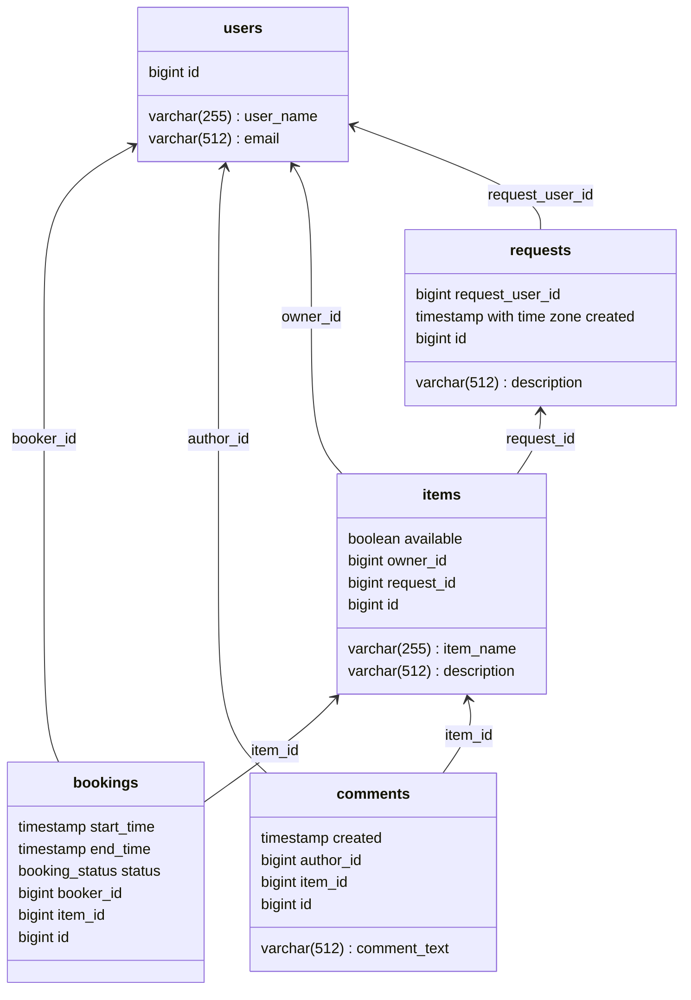

# java-shareit
Repository for study project:

    ┌───┬┐         ┌──┐┌┐ 
    │┌─┐││         └┤├┼┘└┐
    │└──┤└─┬──┬─┬──┐││└┐┌┘
    └──┐│┌┐│┌┐│┌┤│─┤││ ││ 
    │└─┘││││┌┐││││─┼┤├┐│└┐
    └───┴┘└┴┘└┴┘└──┴──┘└─┘⠀⠀⠀⠀⠀⠀⠀⠀⠀⠀⠀⠀⠀⠀⠀⠀⠀⠀

Service for searching and booking items that users are willing to share.

ER-diagram ([.png](https://github.com/kmmins/java-shareit/blob/add-item-requests/assets/shareit.png)), ([.md](https://github.com/kmmins/java-shareit/blob/add-item-requests/assets/shareit.md)):

These technologies were used for this project:
Spring Boot, Maven, Lombok, REST, CRUD, PostgreSQL, Jakarta Persistence API, Query Methods, JPQL Query.